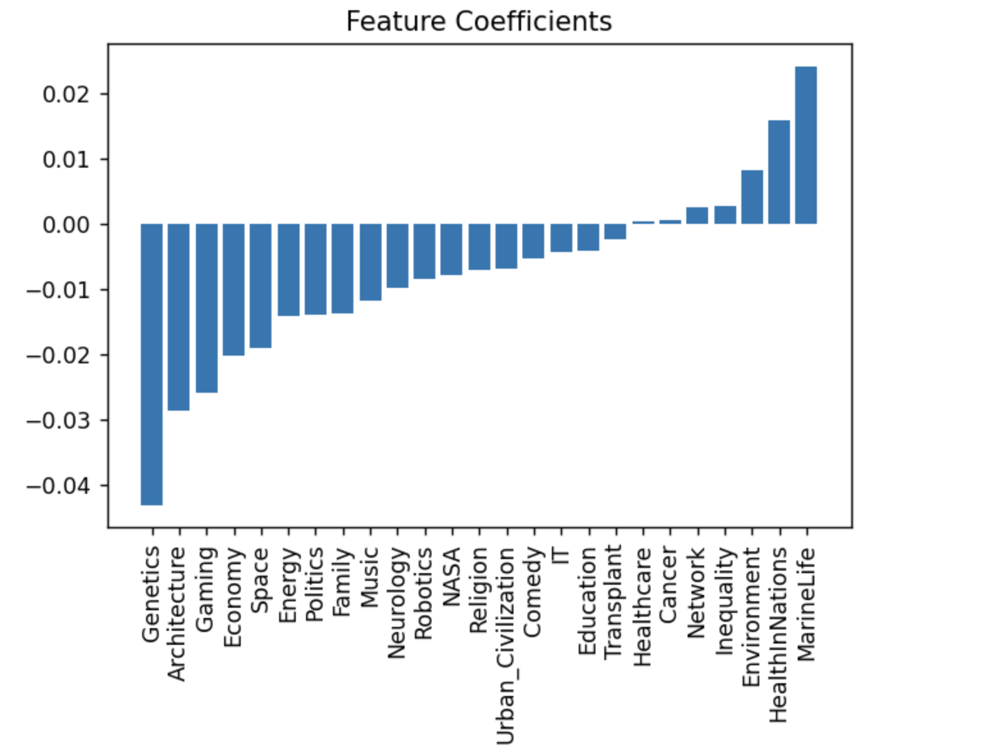

# Natural Language Processing on TED Talks

TED Talks is a platform that enables expert speakers from all backgrounds to present their ideas that can influence a positive change in the society.

My aim was to leverage the capabilities of NLP to understand what words or topics make the most persuasive talks and if any relationships among them. In addition, I focused on how topics evolved over the years. Finally, I would like to build a linear regression model to predict the number of views.
Dataset is downloaded from [here](https://www.kaggle.com/rounakbanik/ted-talks) which is present on Kaggle as a CSV file. Data contained 2467 trancripts from 2006 to 2017 and talks were filtered with a minimum word count of 100.

# Workflow
1. [Topic Modeling & Sentiment Analysis](Final_submission/NLP_TopicModeling.ipynb)
2. [Linear Regression](Final_submission/NLP_Linear_Regression.ipynb)
3. [Presentation Slides](https://github.com/PrasunaM/TED_Talks-MetisNLP/blob/6ef7212542bd2ee12a289ea44ca318c8b0b6be3f/Final_submission/MetisNLPSlides.pdf)

# Conclusion

25 topics were finalized using the TFIDF vectorizer and NMF modeling. The coefficients were saved as a dataframe and a linear regression was fit to predict the number of views for the topics. Linear regression could not perform well as there was no linear relationship among the features and views. Futher work includes working on other modeling techniques with more features to improve accuracy. 

With the current model, the feature importance weighs below topics as important - 

 

   
